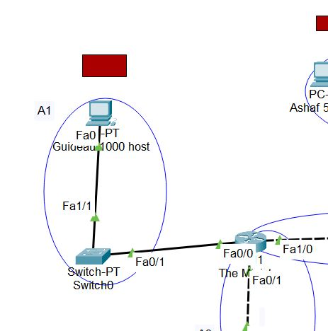
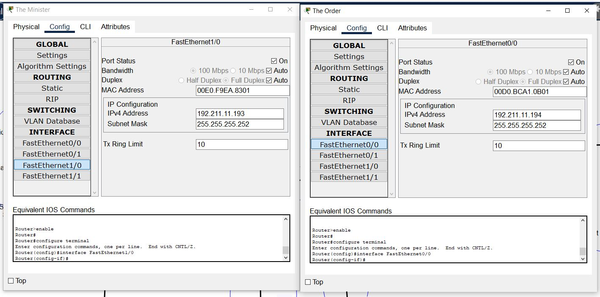

# Jarkom-Modul-4-ITA02-2022

## Hasil Pengerjaan Modul 1 Praktikum Komunikasi Data & Jaringan Komputer 2022

Anggota Kelompok ITA02:
1. Muhammad Faris Anwari (5027201008)
2. Calvindra Laksmono Kumoro (5027201020)
3. Adinda Putri Audyna (5027201073)

Diberikan topologi sebagai berikut:

 
Kemudian dari kami melakukan pemecahan untuk setiap area yang ada pada topologi untuk bisa mengetahui netmask yang digunakan dan dilanjut dengan pemprosesan lebih lanjut dengan pohon. 

Setelah itu dari setiap area kita masukkan ke dalam tabel untuk mempermudah penghitungan dan mengetahui total dari host dan berapa netmask yang akan digunakan
<table>
    <tr>
        <td>Bagian</td>
        <td>Host</td>
        <td>Netmask</td>
        <td> Sorted Netmask</td>
    </tr>
    <tr>
        <td>A1</td>
        <td>1000</td>
        <td>/22</td>
        <td>/22</td>
    </tr>
        <tr>
        <td>A2</td>
        <td>2</td>
        <td>/30</td>
        <td>/23</td>
    </tr>
        <tr>
        <td>A3</td>
        <td>2</td>
        <td>/30</td>
        <td>/23</td>
    </tr>
        <tr>
        <td>A4</td>
        <td>250</td>
        <td>/24</td>
        <td>/24</td>
    </tr>
        <tr>
        <td>A5</td>
        <td>50</td>
        <td>/26</td>
        <td>/24</td>
    </tr>
        <tr>
        <td>A6</td>
        <td>2</td>
        <td>/30</td>
        <td>/25</td>
    </tr>
        <tr>
        <td>A7</td>
        <td>2</td>
        <td>/30</td>
        <td>/25</td>
    </tr>
        <tr>
        <td>A8</td>
        <td>2</td>
        <td>/30</td>
        <td>/25</td>
    </tr>
        <tr>
        <td>A9</td>
        <td>270</td>
        <td>/23</td>
        <td>/26</td>
    </tr>
        <tr>
        <td>A10</td>
        <td>2</td>
        <td>/30</td>
        <td>/30</td>
    </tr>
        <tr>
        <td>A11</td>
        <td>120</td>
        <td>/25</td>
        <td>/30</td>
    </tr>
        <tr>
        <td>A12</td>
        <td>2</td>
        <td>/30</td>
        <td>/30</td>
    </tr>
        <tr>
        <td>A13</td>
       <td>210</td>
        <td>/24</td>
        <td>/30</td>
    </tr>
        <tr>
        <td>A14</td>
        <td>2</td>
        <td>/30</td>
        <td>/30</td>
    </tr>
    <tr>
        <td>A15</td>
        <td>500</td>
        <td>/23</td>
        <td>/30</td>
    </tr>
     <tr>
        <td>A16</td>
        <td>2</td>
        <td>/30</td>
        <td>/30</td>
    </tr>
     <tr>
        <td>A17</td>
        <td>120</td>
        <td>/25</td>
        <td>/30</td>
    </tr>
     <tr>
        <td>A18</td>
        <td>70</td>
        <td>/25</td>
        <td>/30</td>
    </tr>
        <tr>
        <td>Total</td>
        <td>2608</td>
        <td>/20</td>
    </tr>
</table>

Setelah dilakukan perhitungan tabel dimana membutuhkan total host sebanyak 2608 dan netmask terbesar yang dibutuhkan ialah /22, maka kita dapat menggunakan netmask /20 untuk memberikan pengalamatan IP pada subnet.

Jadi untuk NID paling atas yaitu 192.211.0.0 dengan netmask /20. Berikut ini gambaran pohon sekaligus subnetting untuk pembagian IP:

Penjelasan:

- 192.211.0.0/20 dipecah menjadi 2 cabang yaitu 192.211.0.0/21 dan 192.211.8.0/21 
(jika panjangnya /21 maka addressessnya 2048, dimana 2048 itu 8 x 255 (255 merupakan max dalam 1 oktet)

- 192.211.0.0/21 dipecah menjadi 2 cabang yaitu 192.211.0.0/22 dan 192.211.4.0/22 
(jika panjangnya /22 maka addressessnya 1024, dimana yang mendekati 1024 itu 4 x 255 = 1020)

- 192.211.4.0/22 dipecah menjadi 2 cabang yaitu 192.211.4.0/23 dan 192.211.6.0/23
(jika panjangnya /23 maka addressessnya 512, dimana yang mendekati 512 itu 2 x 255 = 510)

dan seterusnya hingga bagian A18. Dengan mengetahui pembagian IP, kita dapat membuat tabel pembagian Network ID dan Subnet Mask untuk mempermudah implementasi sesudah ini.

---
## Subnetting

Setelah menyusun pohon pembagian IP, sekarang kita akan mengimplementasikan pembagian tersebut dalam Cisco Packet Tracer. Pertama, buat dulu topologi yang dimaksud. 

Mari fokus pada area A1.

Kita akan mengatur config router The Minister dan PC Guideau yang mewakili 1000 host, sebagai komponen dari A1. Pertama, klik router The Minister.

Sebagaimana kita lihat di tabel pembagian Network ID dan Subnet Mask, bagian A1 memiliki detail berikut:

    Network ID: 192.211.0.0
    Subnet Mask: 255.255.252.0

Maka pada router, di interface yang mengarah masuk ke A1 (FastEthernet0/0) kita isikan *first available address* untuk subnet tersebut, yakni Network ID + 1, atau `192.211.0.1`. Tak lupa isikan Subnet Masknya dan centang opsi On di Port Status. Kemudian kita beranjak ke PCnya.

Sesuai dengan pohon pembagian IP, host-host di subnet A1 memiliki rentang IP `192.211.0.1-192.211.3.254`, dimana `192.211.3.255` di-*reserve* untuk broadcast address. Demi kemudahan bersama, IP Guideau kita isikan sebagai inkremen satu dari *first available address*. Isi pula subnet mask, lalu default gateway sesuai IP interface router yang menghadap A1.

Untuk contoh subnet antar router, mari fokus pada area A2.

Untuk confignya kurang lebih sama dengan cara sebelumnya. Kita harus memerhatikan detail interface mana yang terlibat di A2. Dalam subnet ini, The Minister menggunakan FastEthernet1/0, dan The Order menggunakan FastEthernet0/0. Isilah IP sesuai tabel pembagian di interface yang sesuai.

Ulangi langkah-langkah di atas pada setiap area guna menuntaskan proses Subnetting.

---
## Routing

Usai menuntaskan Subnetting, kita beranjak ke Routing. Sekali lagi, kita ambil contoh A1. Perhatikan gambar di bawah.

Untuk proses routing A1, kita perlu meng-*config* semua router dari The Resonance menuju A1, berarti kita perlu mengconfig router-router berikut:

    The Resonance -> The Order -> The Minister

Pertama, kita atur routing di The Resonance. Perhatikan bahwa interface The Order yang menghadap The Resonance ialah Fa1/0.

Isikan Network dan Mask sesuai subnet yang dituju, yakni A1. Pada next hop, isikan IP interface router selanjutnya yang menghadap router yang sedang kita atur. Ulangi di The Order.

Terakhir, kita telah sampai di router yang adjacent dengan A1, yakni The Minister. Perhatikan interface The Order yang menghadap The Minister, yakni Fa0/0.

Pada router terakhir, isikan `0.0.0.0` di Network dan Mask. Di next hop, isikan IP interface router sebelumnya yang menghadap router terakhir.

Ulangi langkah-langkah di atas pada subnet-subnet lainnya. Dengan demikian, proses Routing dapat disudahi.

